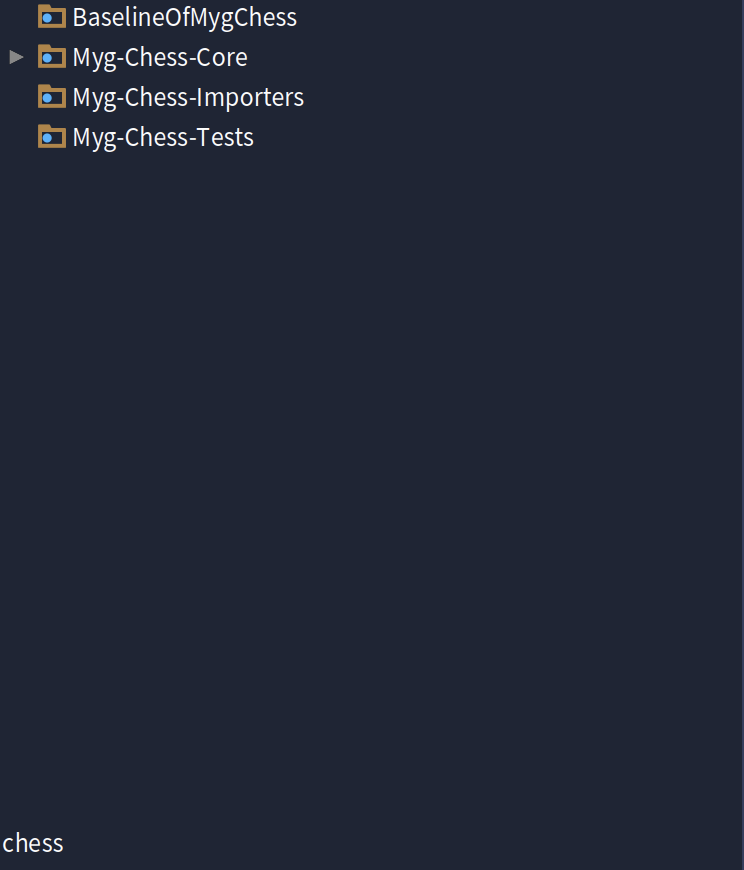

# Chess-Deloison-Da-Costa

## Summary
- [Introcution](#introduction)
	- [Difficulties](#difficulties)
	- [Tests](#tests)
- [Installation instructions](#installation-instructions)
- [Instructions for use](#instructions-for-use)
- [Design decision
](#design-decision)
  - [Kata : Refactoring du rendu des pièces](#kata--refactor-piece-rendering)
- [Authors](#authors)

## Introduction

We have selected two katas: Implement more bot gaming strategies and Refactor piece rendering.

### Difficulties

### Kata : Implement more bot gaming strategies

**Understanding the existing structure**

The implementation of the design pattern itself was relatively quick and straightforward once the overall approach was defined. However, the main difficulty was identifying where the existing “random move” strategy was implemented and triggered. It was necessary to locate the play method inside the Player class, which served as the entry point for automatic gameplay. Once this method was found, the strategy could be properly associated with each player instance, allowing the integration of different AI behaviors without disrupting the existing logic.

**Avoiding code duplication**

When separating the strategy logic, a major challenge was redistributing responsibilities to avoid repeating similar code between strategies while keeping the structure clear and easy to maintain. Since some strategies could share similar behaviors, it was necessary to design a coherent class hierarchy. This required proper dependency separation, ensuring that advanced strategies could build upon simpler ones without redundancy or tight coupling.

**Managing algorithmic complexity**

Adding new decision algorithms increased the code’'s complexity and required multiple refactorings to keep it clear. The cyclomatic complexity also grew quickly, making the code harder to follow and maintain. After isolating the original random play method into its own strategy, new ones had to be created. The simplest was offensive (“if you can capture, then capture”), followed by more advanced logic like capturing while staying safe.

### Kata : Refactor piece rendering

**Identifying the right level of abstraction**

A major challenge was determining where to place the rendering logic: in the rooms, in the boxes, or in a dedicated class.
We had to strike a balance between decoupling and simplicity, so as not to weigh down the architecture while keeping the system flexible and easy to upgrade.

The decision was made to create a dedicated class hierarchy.

**Correspondence dictionary maintenance**

The dictionary mapping piece type, piece colour and square colour is central, but fragile: a typo or forgotten combination can cause incorrect rendering.
Each new piece also requires manual updating of the table, which demands rigour and vigilance.

### Tests

We tested our code mainly using unit tests.
These tests were written at the beginning of the refactoring process, even before the table dispatch was implemented.
They checked that each rendering method returned the correct character according to the type and colour of the piece, as well as the colour of the square.

When we modified certain values or keys in the dictionary, the tests failed, confirming that they correctly detected errors and ensured the validity of the expected behaviour.

In the section on game strategies, we introduced a Strategy pattern to make player behaviour extensible.
Instead of a player having a single strategy, they now call on an external strategy that runs independently.
We also implemented unit tests to verify that each strategy was called correctly and produced the expected moves, ensuring the new design functioned properly. To reduce code repetition, we created mocks for game scenarios using a builder design pattern.

## Installation instructions


This code has been tested with Pharo 13. You can install it using the following baseline :

```smalltalk
Metacello new
	repository: 'github://antonindeloison/Chess-Deloison-Da-Costa:main';
	baseline: 'MygChess';
	onConflictUseLoaded;
	load.
```

## Instructions for use

You can open the chess game using the following expression:

```smalltalk
board := MyChessGame freshGame.
board size: 800@600.
space := BlSpace new.
space root addChild: board.
space pulse.
space resizable: true.
space show.
```

**Where is code and tests ?**

In the System Browser, set a filter for "chess". You should see:



- The code is in: Myg-Chess-Core
- The tests are in: My-Chess-Tests

## Design decision

### Kata : Implement more bot gaming strategies

Initial solution:

```Smalltalk
MyPlayer >> play

	| pieces |
	pieces := self king isInCheck
		          ifTrue: [ OrderedCollection with: self king ]
		          ifFalse: [ self pieces copy asOrderedCollection ].


	[ pieces notEmpty ] whileTrue: [
		| piece legalMoves |
		piece := pieces atRandom.
		pieces remove: piece.
		legalMoves := piece legalTargetSquares.
		legalMoves ifNotEmpty: [
			game move: piece to: legalMoves atRandom.
			^ self ] ].

	self halt: 'NO MOVES AVAILABLE!'
```

**Goal**: Implement multiple bot gaming strategies with clean architecture.

Presentation of design choices to solve this problem

We started by tackling the problem at its architectural level without changing the behaviour. The original implementation had gaming logic hardcoded directly in the `play:` method of **MyPlayer**, violating the Single Responsibility Principle and making it impossible to extend with new strategies.

1. Strategy Pattern Implementation

The first step was to extract the gaming logic into a separate hierarchy using the **Strategy Design Pattern** :

```Smalltalk
MyPlayer >> initialize
    super initialize.
    self gamingStrategy: RandomGamingStrategy new
```

```Smalltalk
MyPlayer >> play
    gamingStrategy play: self
```

This delegation allows the player to focus only on being a player, while the strategy handles the decision-making process. The strategy can be changed at runtime, providing flexibility (strategy selection during the game for example).

2. Template Method Pattern
We implemented a **Template Method** in the abstract strategy class to define the common algorithm structure:

```Smalltalk
AbstractGamingStrategy >> kingIsInCheck: aPlayer
    ^ aPlayer king isInCheck
        ifTrue: [ OrderedCollection with: aPlayer king ]
        ifFalse: [ aPlayer pieces copy asOrderedCollection ]
````
```Smalltalk
AbstractGamingStrategy >> executeRandomMoveFrom: aCollection for: aPlayer
    | move |
    move := aCollection atRandom.
    aPlayer game move: move first to: (move at: 2).
    ^ aPlayer
```
```Smalltalk
AbstractGamingStrategy >> noMovesAvailable

	self halt: 'NO MOVES AVAILABLE!'
```

This templates are used with self sends that provide late binding through polymorphism.

```Smalltalk
DefensiveGamingStrategy >> getAllOtherMoves: aPlayer
    
    | allMoves pieces |
    allMoves := OrderedCollection new.
    pieces := self kingIsInCheck: aPlayer.
    
    pieces do: [ :piece |
        piece legalTargetSquares do: [ :targetSquare |
            allMoves add: (Array with: piece with: targetSquare) ] ].
    
    ^ allMoves
```

```Smalltalk
DefensiveGamingStrategy >> play: aPlayer
	"Defensive strategy that saves a piece in danger else do a random legal move"

	| escapeMoves allMoves |
	escapeMoves := self getEscapeMoves: aPlayer.
	escapeMoves notEmpty ifTrue: [
		^ self executeRandomMoveFrom: escapeMoves for: aPlayer ].

	allMoves := self getAllOtherMoves: aPlayer.
	allMoves notEmpty ifTrue: [
		^ self executeRandomMoveFrom: allMoves for: aPlayer ].

	self noMovesAvailable
```

3. Inheritance Hierarchy

We designed a clear inheritance hierarchy in which each strategy shares and implements common methods.

**Original hierarchy ideas**

- **AbstractGamingStrategy** (abstract base class)
- **RandomGamingStrategy** (original random move selection)
- **OffensiveGamingStrategy** (captures when possible)
- **DefensiveGamingStrategy** (prioritizes piece safety)
- **MixedGamingStrategy** (inherits from **DefensiveGamingStrategy** with safe captures)

Each strategy responds polymorphically to the same message `play:` but implementing different behaviors:

```smalltalk
OffensiveGamingStrategy >> play: aPlayer
	"Offensive strategy: capture an enemy piece if possible; otherwise perform a random legal move."

DefensiveGamingStrategy >> play: aPlayer
	"Defensive strategy: save a piece in danger; otherwise perform a random legal move."

MixedGamingStrategy >> play: aPlayer
	"Mixed strategy:
	 1. Save a piece in danger.
	 2. Make a safe capture.
	 3. Make a safe move.
	 4. If none apply, perform a random legal move."
```

In conclusion, with the **Strategy Pattern**, **Template Method**, and a clear **Inheritance Hierarchy**, the design is cleaner, extensible, and easy to maintain.Each strategy owns its behavior and can be swapped at runtime, ensuring flexibility, and clear separation of concerns.


### Kata : Refactor piece rendering

Initial solution: 


```smalltalk
MyChessSquare >> renderKnight: aPiece

	^ aPiece isWhite
		  ifFalse: [ color isBlack
				  ifFalse: [ 'M' ]
				  ifTrue: [ 'm' ] ]
		  ifTrue: [
			  color isBlack
				  ifFalse: [ 'N' ]
				  ifTrue: [ 'n' ] ]
`````
**Goal:** remove the ifs. 


Presentation of design choices to solve this problem.

We started by tackling the problem at its source. Here, the first call to the rendering system is made in:

```smalltalk
MyChessSquare >> contents: aPiece

	| text |
	contents := aPiece.

	text := contents
		        ifNil: [
				        color isBlack
					        ifFalse: [ 'z' ]
					        ifTrue: [ 'x' ] ]
		        ifNotNil: [ contents renderPieceOn: self ].
	piece text: (text asRopedText
			 fontSize: 48;
			 foreground: self foreground;
			 fontName: MyOpenChessDownloadedFont new familyName)
`````

The first thing to implement is a **double dispatch** to obtain the type of piece, the colour of the piece and the colour of the square, in order to determine which character to return.

To begin with, **MyChessSquare >> contents: aPiece** sends a message to a piece of type x to find out its type.  
In this example, the piece type will be MyKnight.


**The message renderPieceOn: aSquare** is applied to an object of type **MyKnight**, which then tells **aSquare** that the rendering must be performed for an object of its type and passes itself as an argument.

```smalltalk
MyKnight >> renderPieceOn: aSquare

	^ aSquare renderKnight: self
```

Next, the square tells the render Knight that the rendering must be done for a MyKnight-type piece, and she gives the piece and herself to MyKnightRender.

```smalltalk
MychessSquare >> renderKnight: aPiece

	^ MyKnightRender new render: aPiece on: self
```

This is where the **double dispatch** ends. We used it to determine which render to use based on the type of piece currently positioned on the square. **This double dispatch was already present; we only modified the body of the method  MyChessSquare >> renderX: aPiece**, in order to implement a MyRender hierarchy in the dispatch table. It was essential to recall how this double dispatch works in order to fully understand why we made this modification.

Now, let's move on to the core of the modification, which is the addition of a MyRender hierarchy containing a **dispatch table**.

The MyRender class is abstract and has a render for each type of piece. Each render has a render method that takes a piece and a square as arguments.

In our example, we will use MyKnightRender.

```smalltalk
MyKnightRender >> render: aPiece on: aSquare

	| pieceColor squareColor key |
	pieceColor := self colorNameFor: aPiece isWhite.
	squareColor := self colorNameFor: aSquare isWhite.
	key := {
		       #knight.
		       pieceColor.
		       squareColor }.
	^ self pieceTables at: key ifAbsent: [ 'Erreur' ]
````

The render method aims to construct the key used to find the correct character in the dictionary based on:
- The type of piece
- The colour of the piece
- The colour of the square

Finally, MyRender has the dictionary in which each of its subclasses retrieves its value.

```smalltalk
MyRender >> pieceTables

	^ pieceTables ifNil: [
			  pieceTables := Dictionary new.

			  "Knight"
			  pieceTables at: { #knight. 'white'. 'white' } put: 'N'.
			  pieceTables at: { #knight. 'white'. 'black' } put: 'n'.
			  pieceTables at: { #knight. 'black'. 'white' } put: 'M'.
			  pieceTables at: { #knight. 'black'. 'black' } put: 'm'.

			  "Bishop"
			  pieceTables at: { #bishop. 'white'. 'white' } put: 'B'.
			  pieceTables at: { #bishop. 'white'. 'black' } put: 'b'.
			  pieceTables at: { #bishop. 'black'. 'white' } put: 'V'.
			  pieceTables at: { #bishop. 'black'. 'black' } put: 'v'.

			  "King"
			  pieceTables at: { #king. 'white'. 'white' } put: 'K'.
			  pieceTables at: { #king. 'white'. 'black' } put: 'k'.
			  pieceTables at: { #king. 'black'. 'white' } put: 'L'.
			  pieceTables at: { #king. 'black'. 'black' } put: 'l'.

			  "pawn"
			  pieceTables at: { #pawn. 'white'. 'white' } put: 'P'.
			  pieceTables at: { #pawn. 'white'. 'black' } put: 'p'.
			  pieceTables at: { #pawn. 'black'. 'white' } put: 'O'.
			  pieceTables at: { #pawn. 'black'. 'black' } put: 'o'.

			  "queen"
			  pieceTables at: { #queen. 'white'. 'white' } put: 'Q'.
			  pieceTables at: { #queen. 'white'. 'black' } put: 'q'.
			  pieceTables at: { #queen. 'black'. 'white' } put: 'W'.
			  pieceTables at: { #queen. 'black'. 'black' } put: 'w'.

			  "rook"
			  pieceTables at: { #rook. 'white'. 'white' } put: 'R'.
			  pieceTables at: { #rook. 'white'. 'black' } put: 'r'.
			  pieceTables at: { #rook. 'black'. 'white' } put: 'T'.
			  pieceTables at: { #rook. 'black'. 'black' } put: 't'.

			  pieceTables ]
````

In conclusion, thanks to **double dispatch** and **table dispatch**, we arrive at a solution without if statements, code is clean, readable applies the Don't ask, tell principle and is open to extensions.

The goal of creating one class per render is to allow for potential future extensions.

## Authors

- Matéo DA COSTA
- Antonin DELOISON
